# Experiments meeting 1

This is a presentation of results of experiments on assignment 5 for the first feedback meeting.

## 1: Temperature plots

Strategy: Tries to sample 50 delta values for a maximum of 250 iterations. Takes a random operator applies it to the base solution (without modifiying the solution). Keeps delta values > 0 and averages their values (approximates $E[\Delta | \Delta > 0]$). Temperature decreases with a fixed schedule, and increases after escape algorithm is applied ($T' = max(T, T0 * 0.25$)).

### F10

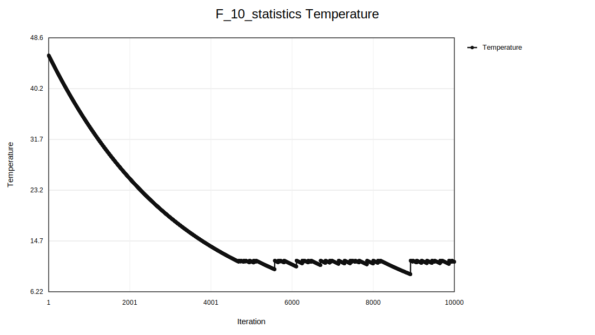

### R10

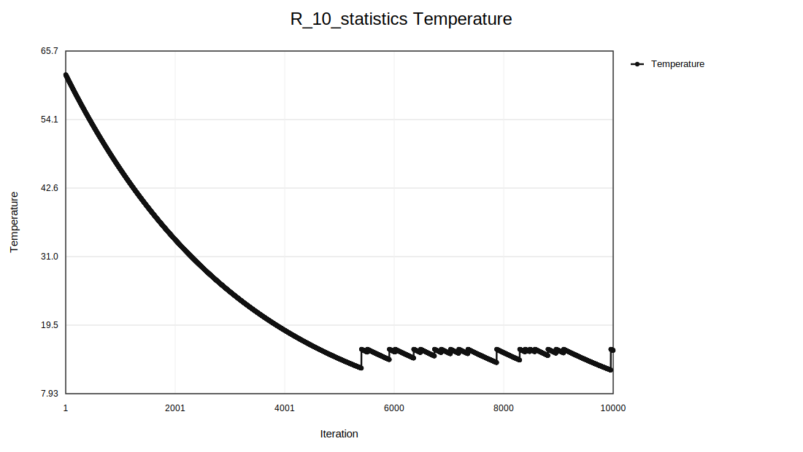

### F100

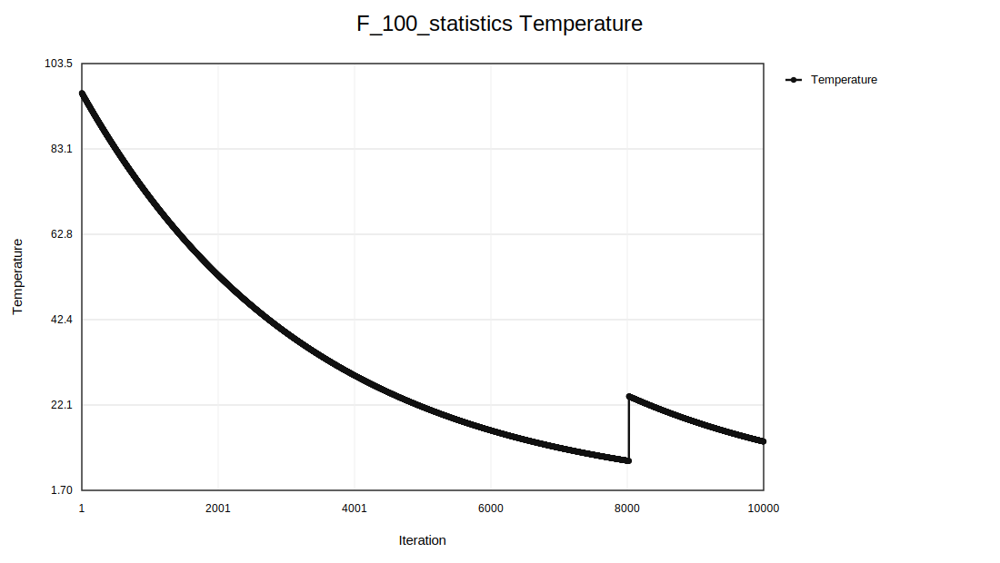

### R100

## Probability of Acceptance Plot

Not 100% sure I understood this correctly - displays theoretical probability values $p$ on which acceptance is conditional. It is -1 and filtered out when a better solution is accepted, and creates a point whenever a worse move is evaluated (not necessarily accepted).
Again, the density sometimes jumps because of the temperature increase after escape.

### F10

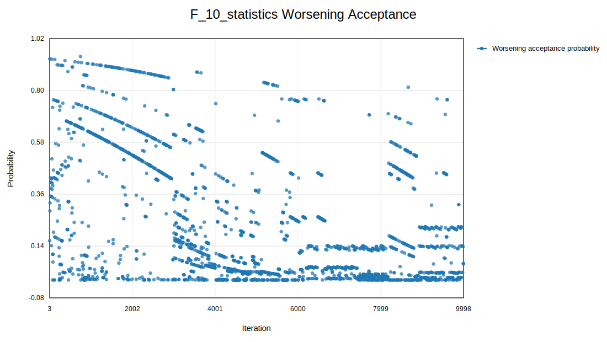

### R10

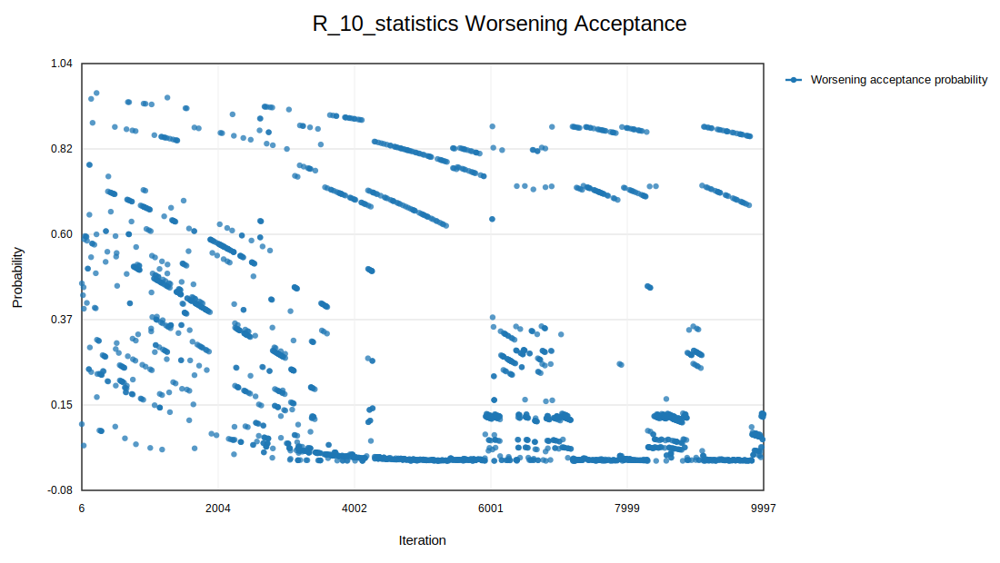

### F100

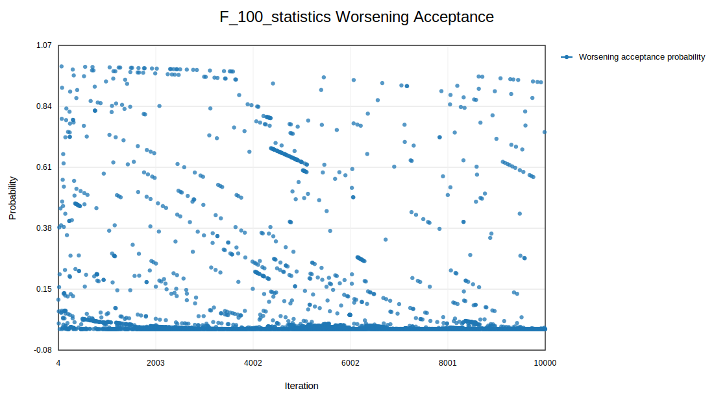

### R100

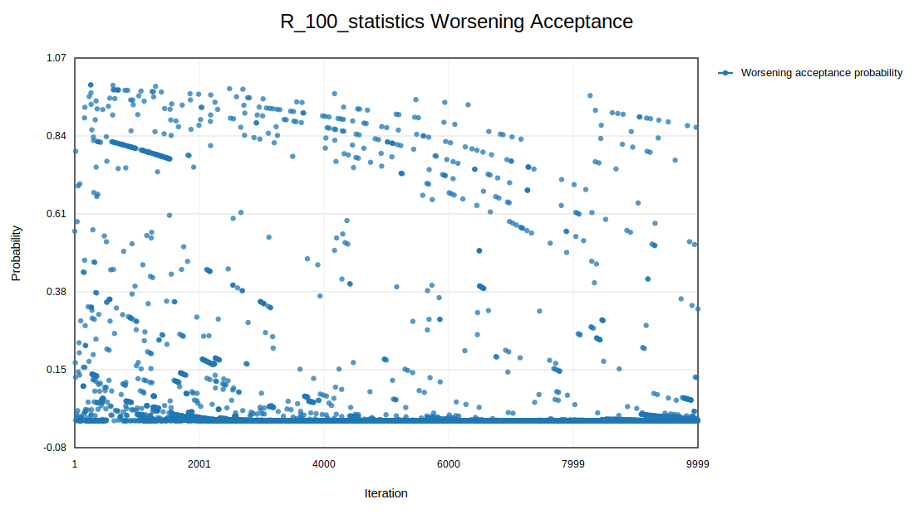

## Best Solution Iteration Report

See the `best_found_iters` folder.

## Delta Value per Operator Plot

See the separate `{dataset}delta_by_operator` folders.

## Operator Weights Plot

Weight updates are done in segments of 100 using statistics from the run.

I use a custom adaptive weight update inspired by ALNS but a little different.

Rewards:
A small fixed reward is given simply if the solution is accepted (0.1), and a reward of 2 is given if a new best is found.
Additionally, a reward is given if the solution is an improvement $(min(5.0, (-\Delta) / \Delta_{scale}))$, where $\Delta_{scale}$ is $max(1, \Delta_0)$ (the sampled $\Delta$ value at the start of the run).

As I have quite a lot of diversification anyway, I chose not to give any reward to new discovered solutions yet. But I think it may be an improvement point in my algorithm to add solution caching, avoiding revisiting the same solutions. Then I could both save time on calculation and this would allow me to give a reward for finding a new solution.

### F10

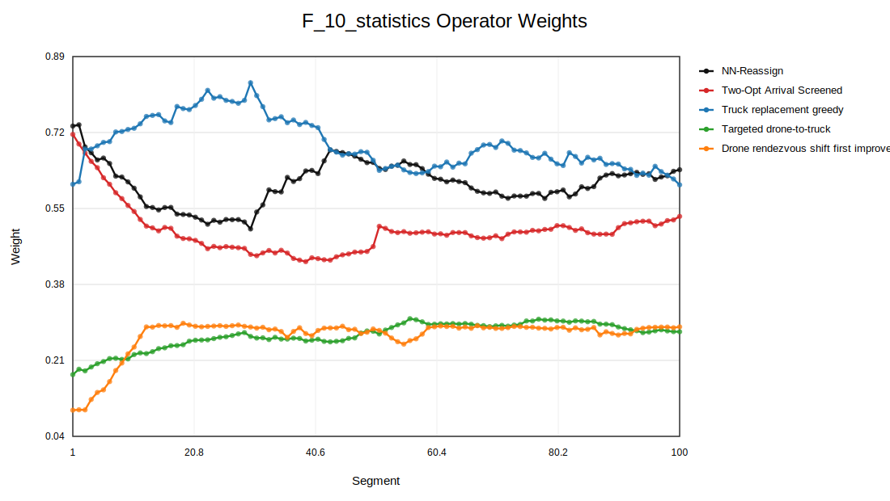

### F20

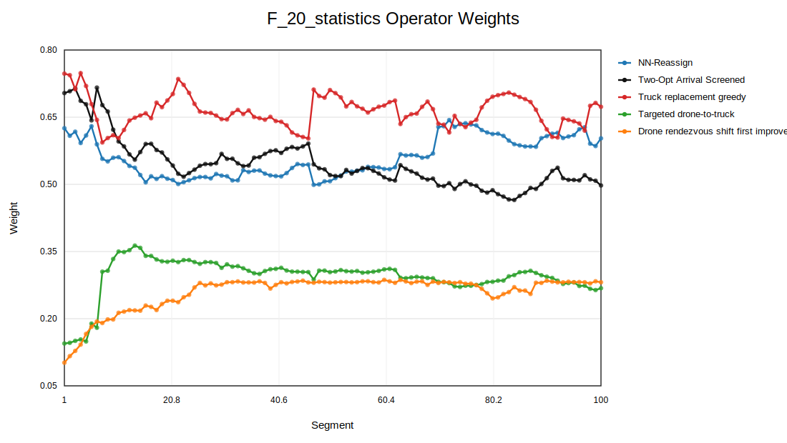

### F50

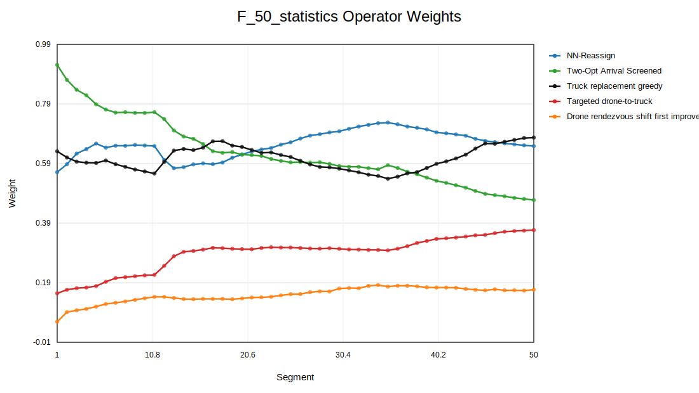

### F100

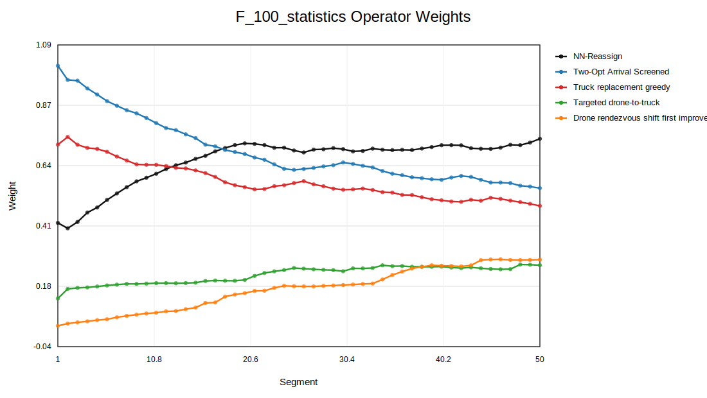

### R10

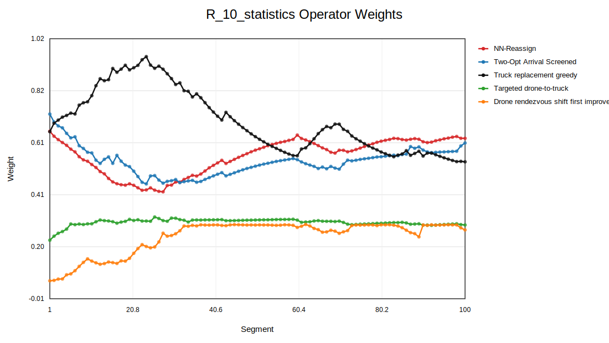

### R20

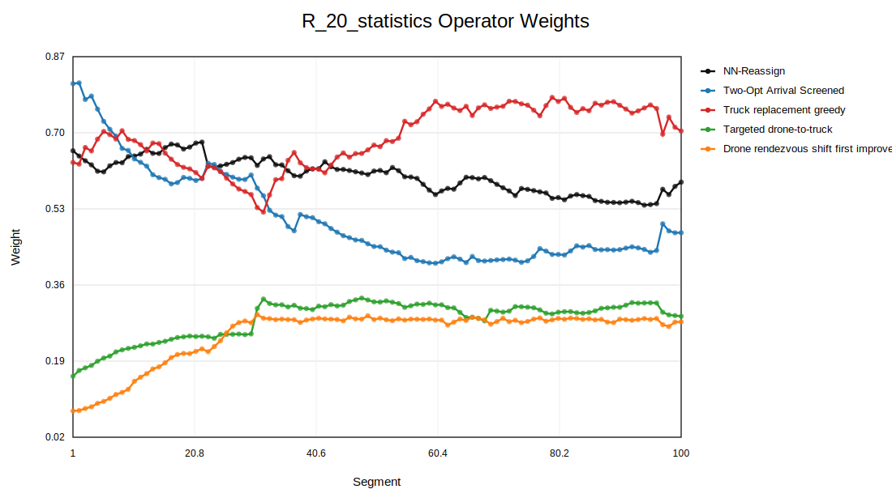

### R50

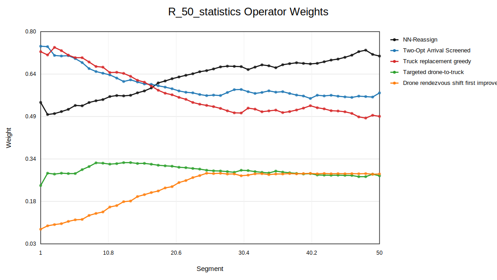

### R100

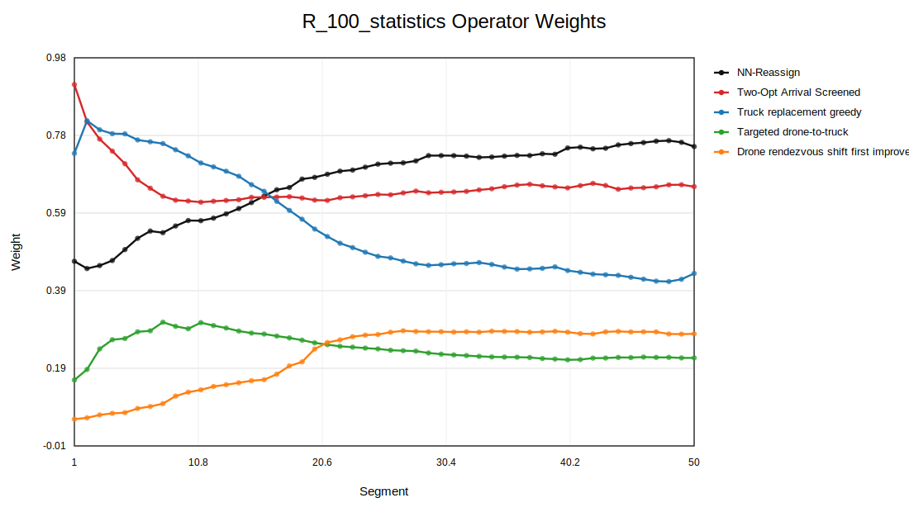

## Objective Value Report

See the `best_found_iters` folder.
